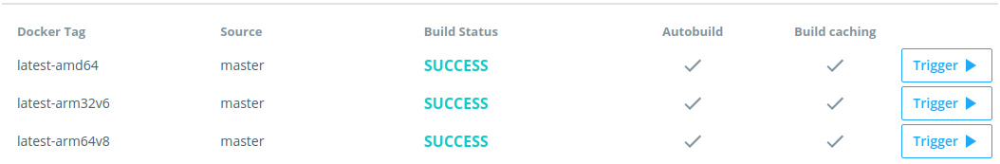
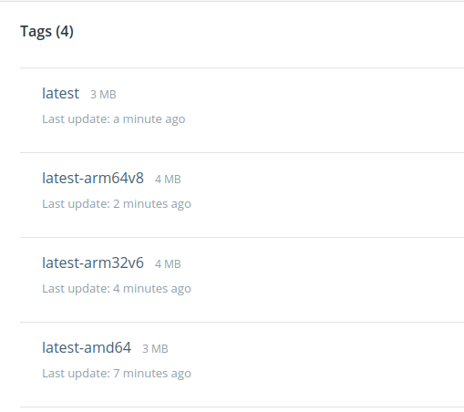
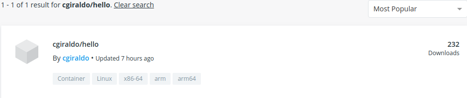

# Automated-build of a Hello-Multiarch docker image 

This repo provides an example of a multi-arch docker image created from a github repo with dockerhub automated-builds.


## Quick Guide

Fork this repo. Configure your dockerhub repo automated build pointing to your fork and with the following Build Rules:



Trigger all the image variants. 
Your dockerhub repo should have now 4 tags (latest-amd64, latest-arm64v8, latest-arm32v6 and latest):



And must be identifed as a multi-arch image  in Dockerhub search results:




## Build Multiarch images locally

scripts at hooks/ folder are designed to work with dockerhub automated-build. 
If you want to try the build phases locally follow next steps:

### post_checkout 
We need qemu to build with target architecture different from host architecture.
hooks/post_checkout download the qemu handle for the Dockerfile.arch architecture.
```
DOCKERFILE_PATH=Dockerfile.arm32v6 ./hooks/post_checkout
DOCKERFILE_PATH=Dockerfile.arm64v8 ./hooks/post_checkout
```
For DOCKERFILE_PATH=Dockerfile makes nothing.

### pre_build
qemu interpreter must be set in docker.
hooks/pre_build register all qemu handlers as binfmt interpreter in docker.

Just Downloading and registering qemu handlers:

```
DOCKERFILE_PATH=Dockerfile.arm32v6 ./hooks/pre_build
DOCKERFILE_PATH=Dockerfile.arm64v8 ./hooks/pre_build
```
For DOCKERFILE_PATH=Dockerfile makes nothing.

### build

```
docker build -f Dockerfile -t hello:latest-amd64 .
docker build -f Dockerfile.arm32v6 -t hello:latest-arm32v6 .
docker build -f Dockerfile.arm64v8 -t hello:latest-arm64v8 .
```

You can verify image corresponde to the target architecture:
```
docker run --rm hello:latest-arm64v8
hello from a aarch64 machine!
```

### post_push 
A multiarch image manifest is important to let docker transparently pull the image corresponding to the host architecture.

hooks/post_push first checks if all architecture images exists in dockerhub repo. Then it create the multiarch image manifest and push it to dockerhub.
To do that, it must download docker-cli v18.06+ [BUG-Ref](https://github.com/docker/cli/issues/1135), enable the experimental manifest subcommand and *docker login* to dockerhub repo.

To build the manifest local just use docker-cli v18.06+ in your host and enable experimental manifest subcommand adding "experimental":"enabled" to your ~./docker/config.json.
Then you can run:

```
docker manifest create hello:latest hello:latest-amd64 hello:latest-arm32v6 hello:latest-arm64v8
docker manifest annotate hello:latest hello:latest-arm32v6 --os linux --arch arm
docker manifest annotate hello:latest hello:latest-arm64v8 --os linux --arch arm64
```

docker-cli provides a command to update the multiarch manifest to dockerhub with docker manifest push MANIFEST_NAME


References:

- [https://lobradov.github.io/Building-docker-multiarch-images/](https://lobradov.github.io/Building-docker-multiarch-images/)
- [https://ownyourbits.com/2018/06/27/running-and-building-arm-docker-containers-in-x86/](https://ownyourbits.com/2018/06/27/running-and-building-arm-docker-containers-in-x86/)

